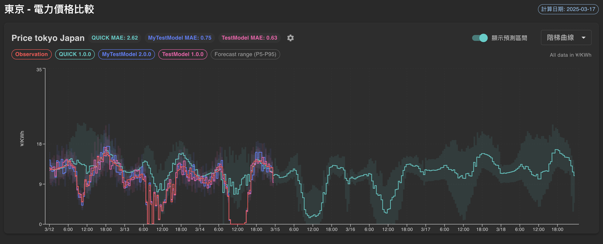

# 🔌 JP Electricity Spot Market Dashboard

> **日本電力現貨市場資料視覺化 — 即時價格、預測與儲能收益分析**



日本電力交易資料視覺化專案，涵蓋 JEPX 現貨價格、多模型預測、儲能優化與案場收益分析。以 **FastAPI** 後端搭配 **Next.js** 前端實作。

---

## ✨ 功能特色

- 📊 **多模型價格預測** — Mersol、Volue 等預測資料，支援 P5/P50/P95 百分位數
- 🗾 **九大區域覆蓋** — 北海道、東北、東京、中部、北陸、關西、中國、四國、九州
- ⚡ **JEPX 市場數據** — 現貨、時間前、需給調整市場、不平衡價格
- 📈 **電網營運資訊** — OCCTO 供需、連系線、發電廠停機 (HJKS)、天氣
- 🔋 **儲能優化** — PuLP 線性規劃，電池充放電排程與收益模擬
- 📉 **案場收益分析** — 實際收益、模型模擬、甘特圖視覺化
- 🔐 **JWT 登入** — 使用者認證與 Token 授權
- 📥 **CSV 匯出** — 下載現貨價格與預測資料

---

## 🛠️ 技術架構

| 層級 | 技術 |
|------|------|
| **前端** | Next.js 15, React 19, TypeScript, Material UI 6, ECharts |
| **後端** | FastAPI, Pydantic, SQLAlchemy (async) |
| **資料庫** | SQLite (使用者資料), Elasticsearch (市場與預測資料) |
| **優化** | PuLP, Pandas, NumPy |
| **基礎設施** | Docker, Docker Compose, Nginx |

---

## 🚀 快速開始

### 必要條件

- [Docker](https://www.docker.com/get-started) & Docker Compose
- (可選) Node.js 18+、Python 3.11+ 供本機開發

### 1. 複製專案並設定環境變數

```bash
git clone <repository-url>
cd hdre-jp-electricity-spot-price-dashboard

# 複製並編輯環境變數
cp .env.example .env
```

### 2. 設定 `.env`

編輯 `.env` 進行設定：

```env
PROJECT_NAME=jpex-dashboard
PROJECT_PORT=6873
DEBUG=True

# Elasticsearch（市場資料來源）
ELASTICSEARCH_HOST=your-es-host
ELASTICSEARCH_PORT=9200
ELASTICSEARCH_USERNAME=
ELASTICSEARCH_PASSWORD=

# 儲能優化參數（可選）
P_MAX_CH=2000
P_MAX_DIS=2000
E_CAP=8000
SOC_MIN_PCT=0.0
SOC_MAX_PCT=1.0
COST_CYCLE=0.0
MIN_BID=0.0
```

### 3. 啟動 Docker

```bash
docker-compose build && docker-compose up
```

🎉 **存取儀表板：** http://localhost:6873

### 4. 建立管理員帳號

```bash
# PowerShell
.\dev-tool.ps1 create-superuser

# Bash
./dev-tool.sh create-superuser
```

預設帳號：`admin` / 密碼：`1234`（可透過參數自訂）

---

## 📖 介面與文件

| 資源 | URL |
|------|-----|
| **儀表板** | http://localhost:6873 |
| **Swagger API** | http://localhost:6873/api/docs |
| **ReDoc API** | http://localhost:6873/api/redoc |

---

## 📂 專案結構

```
hdre-jp-electricity-spot-price-dashboard/
├── backend/                    # FastAPI 後端
│   ├── app/
│   │   ├── api/v1/             # API 路由
│   │   │   ├── auth.py         # 登入、JWT
│   │   │   ├── area.py         # 區域列表
│   │   │   ├── market_info.py  # 市場資料（JEPX、imbalance、HJKS 等）
│   │   │   ├── revenue.py      # 儲能優化
│   │   │   └── prediction.py   # 預測與 CSV 下載
│   │   ├── services/           # Elasticsearch、優化邏輯
│   │   ├── models/             # SQLAlchemy 模型
│   │   └── config.py
│   ├── alembic/                # DB migrations
│   ├── scripts/                # create_user 等工具
│   ├── Dockerfile
│   └── requirements.txt
├── frontend/
│   └── electricity-market-prediction/  # Next.js 應用
│       └── src/
│           ├── app/            # 頁面路由
│           │   ├── login/
│           │   └── dashboard/
│           │       ├── page.tsx       # 總覽
│           │       ├── forecast/      # 預測分析
│           │       ├── site-revenue/  # 案場收益
│           │       ├── settings/
│           │       └── about/
│           ├── components/
│           ├── context/
│           ├── hooks/
│           └── services/
├── nginx/                      # Nginx 設定
├── docker-compose.yml
├── data-mapping.md             # Elasticsearch Index 與爬蟲文件
└── .env.example
```

---

## 🔧 開發工具

```bash
# 建立管理員
.\dev-tool.ps1 create-superuser [username] [email] [password]

# 進入後端容器 shell
.\dev-tool.ps1 shell

# 執行 DB migration
.\dev-tool.ps1 migration

# 重新建立並附加到後端容器（debug）
.\dev-tool.ps1 backend-debug

# 重新載入 Nginx
.\dev-tool.ps1 reload-nginx
```

### 完整重建

```bash
docker-compose down -v && docker-compose build && docker-compose up
```

---

## 📊 Elasticsearch Index

市場與預測資料來自 Elasticsearch，可參考 `data-mapping.md` 了解各 Index 與欄位格式。

| Index | 說明 |
|-------|------|
| `prediction` | 預測價格 (Mersol、Volue) |
| `jepx_spot_area_price` | JEPX 現貨區域價格 |
| `jepx_spot_system` | JEPX 系統價格、投標量等 |
| `jepx_intraday` | 時間前市場 |
| `imbalance` | 不平衡價格 |
| `hjks_outage` | 發電廠停機 |
| `occto_area` | 區域供需實績 |
| `occto_inter` | 連系線數據 |
| `occto_event` | 需給調整事件 |
| `tdgc` | 需給調整市場實績 |
| `weather_actual` | 實際天氣 |
| `weather_forecast` | 天氣預報 |
| `battery_data` | 電池數據 |
| `bid_plans` | 投標計畫 |

---

## 📸 截圖

| 總覽 | 預測分析 | 案場收益 |
|------|----------|----------|
|  | *新增截圖* | *新增截圖* |

---

## 📄 授權

本專案為專屬專案，版權所有。

---

## 🤝 貢獻

貢獻前請先閱讀 `data-mapping.md` 了解資料來源與 Index 結構。
